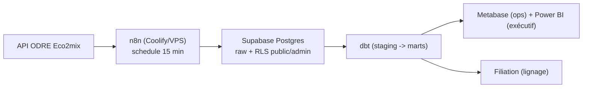

# Projet 18 — Monitoring temps réel du mix énergétique (RTE Eco2mix)

> **🚧 En cours — Phase 2/7.** Cadrage complet dans l'issue
> [valentinratigniet-byte/valentinratigniet-byte#1](https://github.com/valentinratigniet-byte/valentinratigniet-byte/issues/1)
> (architecture, comparatifs vs alternatives, chiffrage, doctrine
> d'ingénierie). Ce README documente ce qui est **réellement construit et
> vérifié**, pas le plan — voir l'issue pour la roadmap complète.

## 🎯 Problème métier

Suivre en direct la composition du mix électrique français (nucléaire,
éolien, solaire, hydraulique, gaz...) et le taux de CO2 associé, avec une
vraie source temps réel — pas un import one-shot. Objectif secondaire du
portfolio : démontrer une compétence absente jusqu'ici — l'exploitation
d'infra en production (déploiement, secrets, uptime), pas seulement
l'analyse de données déjà là.

## ✅ Ce qui est validé aujourd'hui

- **Source de données confirmée en direct** : API [ODRE](https://odre.opendatasoft.com)
  (`eco2mix-national-tr`), gratuite, sans clé, données réelles récupérées
  avec succès (production par filière, consommation, taux CO2, échanges).
- **Deux pièges réels découverts et documentés** — [docs/pieges-api-rte.md](docs/pieges-api-rte.md) :
  le sens du tri de l'API est inversé par rapport à la convention habituelle,
  et les mesures ne sont consolidées par RTE qu'avec **~24h de retard**
  (les points récents n'ont qu'une prévision, pas la valeur réelle).
- **Ingestion idempotente fonctionnelle** (`src/ingest.py`) : upsert sur
  `date_heure`, testé contre l'API réelle et une base Postgres locale —
  152 mesures ingérées, dont les 52 déjà consolidées par RTE correctement
  peuplées, le reste rattrapé automatiquement lors des polls suivants.
  Self-check d'idempotence inclus (ré-ingérer ne duplique jamais).
- **Infra en production déployée et vérifiée** : VPS Hostinger KVM2 +
  Coolify auto-hébergé, avec n8n et Metabase déployés dessus, tous les deux
  en HTTPS avec un vrai certificat Let's Encrypt (vérifié en direct, pas
  supposé).
- **Supabase branché et validé en conditions réelles** : le schéma raw est
  créé sur le vrai projet Supabase (pas seulement en local), et l'ingestion
  a tourné dessus avec succès (150 mesures, idempotence vérifiée) — même
  code que le local, seul `DATABASE_URL` change.

## 🗂️ Architecture (cible, cf. issue #1)



Aujourd'hui, `src/ingest.py` tourne en local contre un Postgres Docker (port
5435) qui reproduit le schéma cible — même code, juste `DATABASE_URL`
à changer une fois Supabase provisionné (même pattern que les autres
projets du portfolio).

## 🚀 Reproduire l'état actuel

```bash
docker compose up -d                # Postgres local, port 5435
pip install -r requirements.txt
python src/ingest.py --n 150        # ingère les dernières mesures + self-check idempotence
```

## 🗃️ Structure du repo

```
projet-18-monitoring-energie-rte/
├── README.md
├── docker-compose.yml       ← Postgres local (dev), même schéma que la cible Supabase
├── sql/
│   └── 01_schema.sql        ← table raw eco2mix_national_tr
├── src/
│   └── ingest.py            ← poll API ODRE + upsert idempotent + self-check
└── docs/
    └── pieges-api-rte.md    ← 2 comportements réels de l'API, vérifiés en direct
```

## 🧠 Choix de conception notables

- **Idempotence dès la première ligne de code, pas différée** : le cadrage
  (issue #1) avait identifié l'idempotence de l'ingestion comme un angle
  mort à traiter en phase 2 — elle est en fait déjà intégrée dans cette
  toute première version (upsert + self-check), pas repoussée.
- **Le "temps réel" a un vrai délai de consolidation, assumé** : plutôt que
  de masquer le retard de ~24h de RTE, il est documenté et le design (upsert
  sur `date_heure`) le rattrape naturellement sans code spécial.
- **Comparatifs techniques déjà tranchés avant d'écrire du code** : pourquoi
  Supabase (pas Snowflake/BigQuery), n8n (pas Prefect/Airflow), Coolify (pas
  un PaaS managé) — voir l'issue #1, section comparatifs.

---

*Projet 18 du [Portfolio Data](https://github.com/valentinratigniet-byte). Cadrage complet :
[issue #1](https://github.com/valentinratigniet-byte/valentinratigniet-byte/issues/1).
Prochaine étape : infra (VPS + Coolify + Supabase).*
